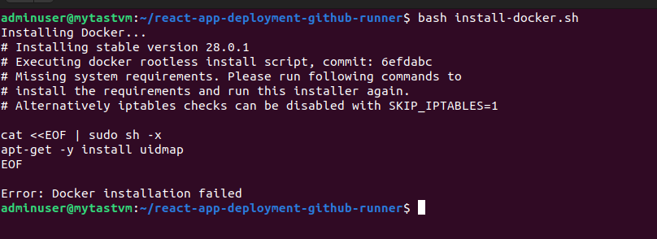
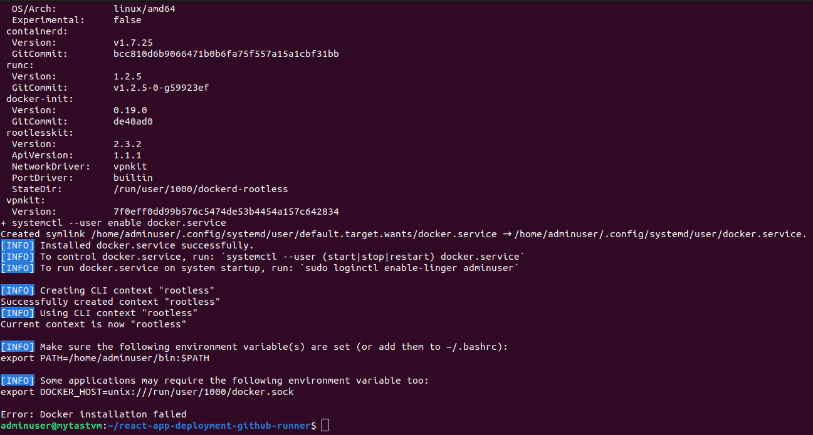
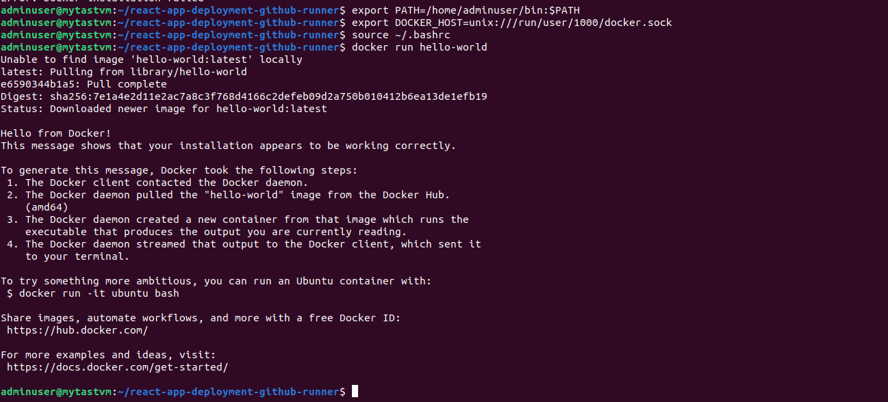
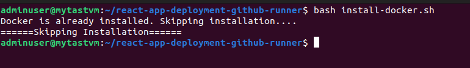

# react-app-deployment-github-runner
This repository contains documentation and snippets regarding first task of the assessment on server setup and deploying a simple react web application with Github hosted runner.

## Server Setup
- Install Docker (if not installed) and skip the installation (if already installed)
- Install Nginx (if not installed), configure and restart the server, and skip (if already installed)

### Docker Installation
- Inorder to install docker with bash script, we first check whether docker is installed on the system or not.
- If installed, we will skip the installation. 
- Due to security considerations, We will perform rootless installation of docker. This means that special privileges `sudo` are not required in order to run docker containers by the user installing the docker.

> Issues faced: While installing rootless docker, certain packages were needed as pre-requisites in linux distribution that I tried running the script. For Debian based linux distributions, following packages were needed in advance. `uidmap` and `dbus-user-session`.

> To resolve the issue, I installed the packages (within the script), depending upon the linux distribution of the host machine conditionally.

> Although, the docker is installed, it shows `Docker installation failed`,  with not being the docker binary path on $PATH. For this, I added the Docker binary location on $PATH variable and exported $DOCKER_HOST variable. Finally, Docker installation was successful.

> Running the script second time, the installation process is skipped.

