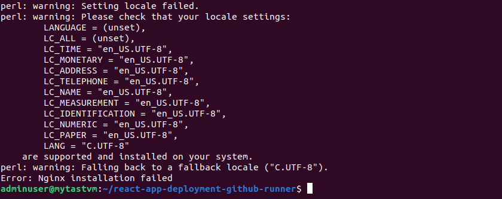

# react-app-deployment-github-runner
This repository contains documentation and snippets regarding first task of the assessment on server setup and deploying a simple react web application with Github hosted runner.

## Server Setup
- Install Docker (if not installed) and skip the installation (if already installed)
- Install Nginx (if not installed), configure and restart the server, and skip (if already installed)

### Docker Installation
- Inorder to install docker with bash script, we first check whether docker is installed on the system or not.
- If installed, we will skip the installation. 
- Due to security considerations, We will perform rootless installation of docker. This means that special privileges `sudo` are not required in order to run docker containers by the user installing the docker.

> [!Caution]
> Issues faced: While installing rootless docker, certain packages were needed as pre-requisites in linux distribution that I tried running the script on. For Debian based linux distributions, following packages were needed in advance. `uidmap` and `dbus-user-session`.

> [!Important]
> To resolve the issue, I installed the packages (within the script), depending upon the linux distribution of the host machine conditionally.

> [!Caution]
> Although, the docker is installed, it shows `Docker installation failed`,  with not being the docker binary path on $PATH. For this, I added the Docker binary location on $PATH variable and exported $DOCKER_HOST variable. Finally, Docker installation was successful.

> I have updated the `install-docker.sh` script to add the docker binary location to $PATH variable, and export the DOCKER_HOST variable. This part in not included in **PDF** document.

> [!Important]
> Running the script second time, the installation process is skipped.

I followed the  guide from Docker documentation.

### Nginx Installation
- First, we check if nginx binary exists or not with `which nginx`.
- Test, if nginx is not only installed but working properly with `nginx -v`.
- We have multiple functions to detect linux distribution, install nginx according to distribution.
- Functions to configure nginx configuration and validate and restart nginx on the machine.
- We invoke different functions by conditionally checking different scenarios for nginx installation and working on the linux machine.

> [!Caution]
> I faced a slight issue while running the script. Although the nginx was installed, configured and started successfully, the script exited with error 1 code stating **Error: Nginx installation failed**.

> [!Important]
> This was really not a installation and configuration issue, but caused due to under privileges of the initial command present in the script to check nginx version (at the end of the script for `verify installation`). This issue was resolved by adding `sudo` before the command to give enough privileges to view the version of nginx (to verify nginx was installed and started as expected).

**Nginx-Installation-Success**

**Nginx-Installation-script-second-run**

## Dependency setup (CI)
- Install Dependency for the project
- Build Docker images
- Push to Docker image to `DockerHub`

I already have a **TODO Application** in React, Express and Postgresql. The source code for the application along with Dockerfiles are present inside the **app** directory.

For Continuous Integration (CI) part, There are **frontend-workflow.yml** and **backend-workflow.yml** files inside **.github/workflows** directory. Each workflow does the same thing, build the docker image, push to DockerHub and deploy new images on the server. But each one is only triggered when there are changes in respective sub-directories inside `app/` directory.

Due to limitations on free account of **DOCKERHUB**, I was able to get a single private repository. For this reason, I separated my frontend and backend docker images through use of tags in the pattern: `username/repository:front-<commit_SHA>` and `username/repository:backend-<commit_SHA>`.

### Access Private Repository on DockerHub
In order to access the private respository on DockerHub, I have provided DockerHub credentials to workflow environment through **Github Repository Secrets**

> [!Important]
> Although it's possible to combine separate workflows into single workflow file, to build the docker image depending upon the changes in sub-directories of `app/` directory. Due to my other commitments, I could not optimise and decided to go with the simple solution for now.

## Deploy images (CD)
For deploying the application from within the workflow, I created a deploy job in each workflow file with steps to `SSH` into the server, and run a bash script that pulls latest docker images (the one which is build during the workflow) and uses `docker compose ` commands to deploy the application. The bash script `deploy.sh` and docker compose file `docker-compose.yaml` are available under `app/` directory.

> [!Caution]
> I faced quite a time consuming issue, while trying to add commit sha to docker image tag. The issue arised due to not being  able to pass environment variables between jobs, since each job runs on different process. Due to this issue, I was not able to deploy new docker images in the server. Finally, after long error and trial (**as seen through commit history**), I finally solved the issue with `actions/upload-artifact` and `actions/download-artifact` actions from Github.

### Deploy Error

### Workflow Run Success

### Application containers on server

### Access application from browser

